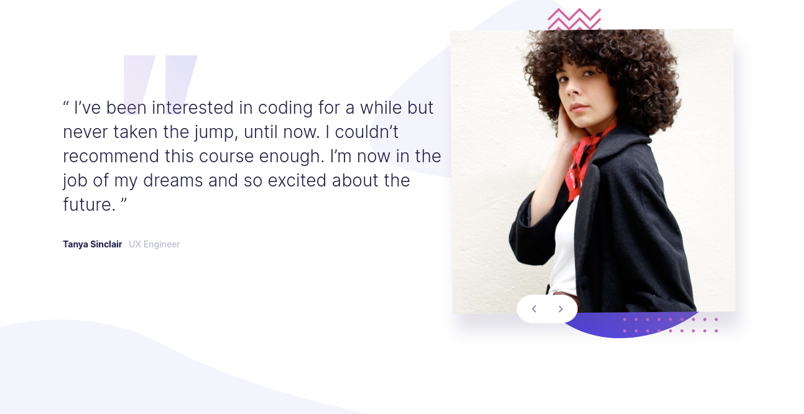

# Frontend Mentor - Coding bootcamp testimonials slider solution

This is a solution to the [Coding bootcamp testimonials slider challenge on Frontend Mentor](https://www.frontendmentor.io/challenges/coding-bootcamp-testimonials-slider-4FNyLA8JL). Frontend Mentor challenges help you improve your coding skills by building realistic projects. 

## Table of contents

- [Frontend Mentor - Coding bootcamp testimonials slider solution](#frontend-mentor---coding-bootcamp-testimonials-slider-solution)
  - [Table of contents](#table-of-contents)
  - [Overview](#overview)
    - [The challenge](#the-challenge)
    - [Screenshot](#screenshot)
    - [Links](#links)
    - [Built with](#built-with)
    - [What I learned](#what-i-learned)
  - [Author](#author)
  - [Acknowledgments](#acknowledgments)


## Overview

### The challenge

Users should be able to:

- View the optimal layout for the component depending on their device's screen size
- Navigate the slider using either their mouse/trackpad or keyboard

### Screenshot
Desktop



Mobile


### Links

- Live Site URL: https://testimonial-slider-aish.netlify.app/


### Built with

- Semantic HTML5 markup
- CSS custom properties
- Flexbox
- SCSS
- Mobile-first workflow
 styles


### What I learned

1. Simple carousel in vanilla javascript.


```
const sliderItem = document.querySelectorAll('.slider__item');
const prevBtn = document.getElementById('btn-prev');
const nextBtn = document.getElementById('btn-next');

let index = 0;
sliderItem[index].classList.add('active');

function prevItem() {
    sliderItem[index].classList.remove('active');
    index = index === 0 ? sliderItem.length -1 : index -1;
    sliderItem[index].classList.add('active');
}
function nextItem() {
    sliderItem[index].classList.remove('active');
    index = index === sliderItem.length-1 ? 0 : index + 1;
    sliderItem[index].classList.add('active');
}

prevBtn.addEventListener('click', prevItem);
nextBtn.addEventListener('click', nextItem);

```
2. Positioning of background pattern image as like the design
3. Animating image 

## Author

- Twitter - [@aishs1231](https://www.twitter.com/yourusername)

## Acknowledgments
I would like to thank frontend Mentor for this challenge. (https://www.frontendmentor.io/)
